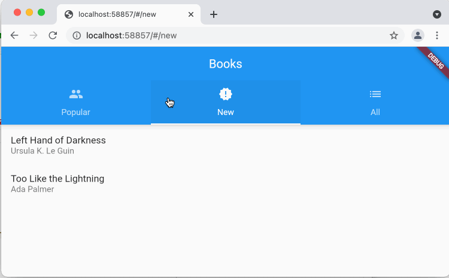
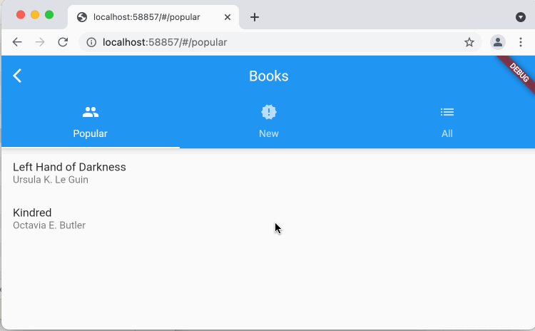
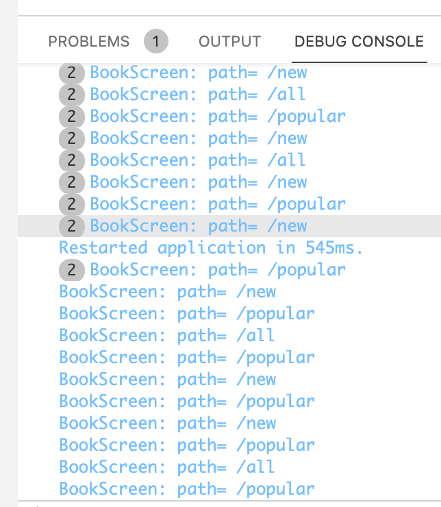

# Just Books
A sample that shows how to use the [Router][] API to handle nested navigation.

# Nested navigation vs. a Back button
In `main.dart`, when setting up the delegate's builder, if we just return the
`BooksScreen`, then we get a lovely transition of the different book lists as
you switch tabs.

```dart
// this works great; it only transitions the change on the page. however, it
// has no concept of Back
Widget _navlessBuilder(BuildContext context) {
  final path = RouteStateScope.of(context)!.route.path;
  return BooksScreen(path);
}
```



On the other hang, if you return a `Navigator` from the delegate's builder, then
you'll see a transition of the entire page as you switch tabs, but you do get a
Back button on the `AppBar`.

```dart
// this causes the whole page to transition, but does enable the Back button
Widget _navfullBuilder(BuildContext context) {
  final path = RouteStateScope.of(context)!.route.path;
  return Navigator(
    pages: [
      const MaterialPage<void>(key: ValueKey('/'), child: HomeScreen()),
      if (path != '/')
        MaterialPage<void>(key: ValueKey(path), child: BooksScreen(path))
    ],
    onPopPage: (route, dynamic result) {
      if (!route.didPop(result)) return false;
      routeState.go('/');
      return true;
    },
  );
}
```




The `Navigator` is what enables popping in response to the back button as well
as enabling the back button to work in the first place. How do we get the back
button to work AND enable those cool nested navigation transitions?

# Bug
For some reason, `RouteState.go()` causes the path to change first to whatever
was passed and then always goes back to `/popular`. For some reason, this is
ignored in the navless case but not in the navfull case. It can be seen in the
Debug Console in either case.

]